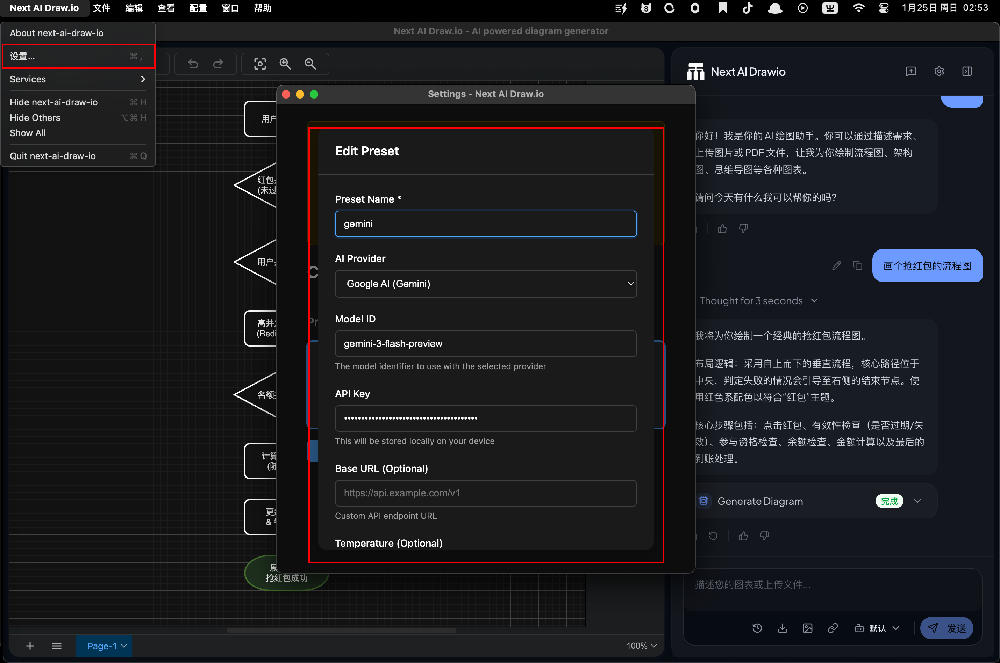
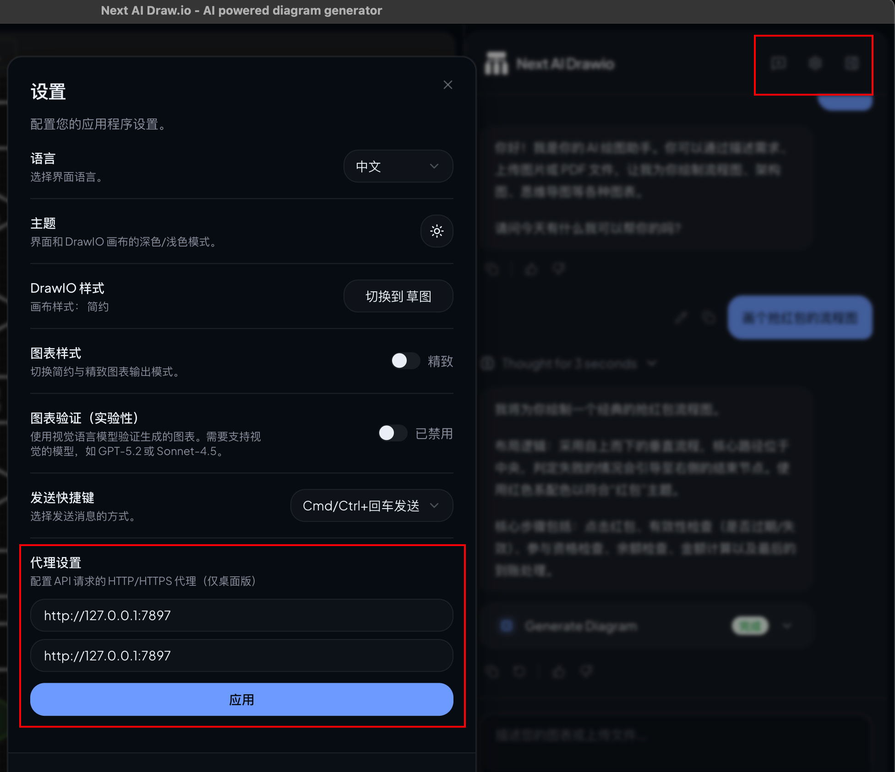

---
tags:
  - macOS
  - 工具
---
# macos

## app

```
adrive
applite
bilibili
charles
clash-verge-rev
douyin
drawio
font-maple-mono
font-maple-mono-nf
font-maple-mono-nf-cn
fsnotes
google-chrome
handbrake-app
iina
imageoptim
iterm2
jordanbaird-ice
keka
logseq
losslesscut
markedit
onyx
qq
rectangle
sequel-ace
snipaste
sourcetree
squirrel-app
switchhosts
tencent-lemon
tencent-meeting
thunder
wechat
zed
```

## alfred

[ip-address.alfredworkflow](/assets/files/ip-address.alfredworkflow)

[sourcetree.alfredworkflow](/assets/files/sourcetree.alfredworkflow)

[TerminalFinder.alfredworkflow](/assets/files/TerminalFinder.alfredworkflow)

## 截图

### qq截图

[QQ截图20260710_6.9.98-51102.dmg](https://www.dropbox.com/scl/fi/d8i5vx1syxbdeifffc5ui/QQ-20260710_6.9.98-51102.dmg?rlkey=4d7dnldzwucq94t9j0wsdn5ir&st=g50wdp5m&dl=0)

```
# 去除 macOS 的隔离标记，否则 Gatekeeper 会拒绝启动 ad-hoc 签名的 app
xattr -cr ~/Desktop/QQ\ ScreenCapture\ plugin.app

# 配置独立运行模式，否则检测不到 QQ 进程后 app 会自动退出
defaults write "$HOME/Library/Preferences/FN2V63AD2J.com.tencent.ScreenCapture3" settingkeyrunalone -bool YES
```

### flameshot

直接github下载或者homebrew安装

### snowshot

直接github下载或者homebrew安装

## sublime text 4200

### 注册

```bash
cd "/Applications/Sublime Text.app/Contents/MacOS/" || exit
md5 -q sublime_text | grep -i "B07FDB3A228A46DF1CC178FE60B64D3B" || exit
echo 01060C90: E0 03 1F AA C0 03 5F D6 | xxd -r - sublime_text
echo 00FEAD18: 1F 20 03 D5             | xxd -r - sublime_text
echo 00FEAD2C: 1F 20 03 D5             | xxd -r - sublime_text
echo 01061F28: C0 03 5F D6             | xxd -r - sublime_text
echo 01060908: C0 03 5F D6             | xxd -r - sublime_text
echo 00FE5780: C0 03 5F D6             | xxd -r - sublime_text

codesign --force --deep --sign - "/Applications/Sublime Text.app"
```

[Sublime_Text_4200.dmg](https://www.dropbox.com/scl/fi/kdp6ykupr6cjcgt3ovwha/Sublime_Text_4200.dmg?rlkey=qjxqbsyv62143sl94diqkd8ku&st=13dg0th8&dl=0)

### 插件

pretty json
rest client

## vscodium

```json
{
    "editor.fontSize": 16,
    "rest-client.enableTelemetry": false,
    "rest-client.previewOption": "exchange",
    "rest-client.environmentVariables": {
        "$shared": {},
        "dev":{
            "host":"http://127.0.0.1:8080"
        }
    },
    "diffEditor.renderSideBySide": false,
    "git.confirmSync": false,
    "git.autofetch": true,
    "markdown-editor.imageSaveFolder": "${projectRoot}/docs/assets/images"
}
```

## 鼠须管配置

### 只保留鼠须管输入法

```bash
# 读取配置
cp ~/Library/Preferences/com.apple.HIToolbox.plist ~/Desktop/HIToolbox_backup.plist
# 按索引删除配置项
sudo plutil -remove AppleEnabledInputSources.1 ~/Library/Preferences/com.apple.HIToolbox.plist
# 上锁
sudo chflags uchg ~/Library/Preferences/com.apple.HIToolbox.plist
```

最终配置文件内容

```bash
# defaults read com.apple.HIToolbox AppleEnabledInputSources
(
        {
        "Bundle ID" = "com.apple.inputmethod.SCIM";
        "Input Mode" = "com.apple.inputmethod.SCIM.ITABC";
        InputSourceKind = "Input Mode";
    },
        {
        "Bundle ID" = "com.apple.CharacterPaletteIM";
        InputSourceKind = "Non Keyboard Input Method";
    }
)
```

### 雾凇拼音

```yaml
# squirrel.custom.yaml
patch:
  # --- 1. 核心视觉逻辑 ---
  "style/color_scheme": macos_light           # 指定系统【浅色模式】下的皮肤方案
  "style/color_scheme_dark": macos_dark      # 指定系统【深色模式】下的皮肤方案（0.15+版本自动切换）
  "style/candidate_list_layout": linear      # 现代线性布局：相比 horizontal，间距控制更自然
  "style/font_face": "SF Pro, PingFang SC"   # 字体：SF Pro 渲染数字英文字符，平方渲染汉字，最强原生感
  "style/font_point": 24                     # 候选词字号大小
  "style/label_font_point": 15               # 序号字号大小：略小于候选词，视觉重心更突出

  # --- 2. 原生质感微调 ---
  "style/corner_radius": 10                  # 整个输入框的外圆角半径
  "style/hilited_corner_radius": 6           # 选中项（蓝色胶囊）的内圆角半径
  "style/hilited_padding": 4                 # 选中项文字与高亮背景块之间的留白（呼吸感关键）
  "style/border_height": 6                   # 输入框上下内边距
  "style/border_width": 10                   # 输入框左右内边距
  "style/line_spacing": 6                    # 多行候选时的行间距（linear布局下影响不大）
  "style/spacing": 12                        # 编码区（拼音）与候选词区之间的间距

  # --- 3. 皮肤方案具体定义 ---
  preset_color_schemes:
    # 浅色原生方案
    macos_light:
      name: "原生浅色"
      back_color: 0xF2F2F2                   # 背景色：BGR格式的浅灰色
      text_color: 0x424242                   # 输入码（拼音）颜色：深灰，区分于候选词
      candidate_text_color: 0x000000         # 候选项文字颜色：纯黑
      hilited_text_color: 0xFFFFFF           # 选中项文字颜色：纯白
      hilited_back_color: 0xD77800           # 选中项背景色：苹果标志性蓝色
      border_color: 0xFFFFFF                 # 边框颜色：白色边框在浅色下更有质感

    # 深色原生方案
    macos_dark:
      name: "原生深色"
      back_color: 0x2D2D2D                   # 背景色：深灰色
      text_color: 0x999999                   # 输入码（拼音）颜色：淡灰
      candidate_text_color: 0xFFFFFF         # 候选项文字颜色：纯白
      hilited_text_color: 0xFFFFFF           # 选中项文字颜色：纯白
      hilited_back_color: 0xD77800           # 选中项背景色：苹果蓝
      border_color: 0x000000                 # 边框颜色：纯黑，与深色模式融为一体
```

```yaml
# rime_ice.custom.yaml
__include: octagram   #启用语法模型
# 语法模型
octagram:
  __patch:
    grammar:
      language: wanxiang-lts-zh-hans
      collocation_max_length: 6
      collocation_min_length: 3
      collocation_penalty: -10
      non_collocation_penalty: -20
      weak_collocation_penalty: -45
      rear_penalty: -12
    translator/contextual_suggestions: false
    translator/max_homophones: 5
    translator/max_homographs: 5
```

### 薄荷拼音

```yaml
# squirrel.custom.yaml
patch:
  # --- 1. 核心交互行为 ---
  "style/inline_ascii": true                    # 输入框内直接预览英文，不弹状态栏
  "menu/page_size": 5                           # 候选词个数固定为 5 个


  # --- 2. 皮肤指定与系统级深浅跟随 ---
  "style/color_scheme": native                  # 浅色模式
  "style/color_scheme_dark": native             # 深色模式
  "style/app_color_schemes": { 暗黑模式: native, 默认: native }


  # --- 3. 字体与大小（对 native 依然生效） ---
  "style/font_face": ""                         # 留空以保持 Emoji 的彩色效果
  "style/font_point": 24                        # 候选字大小
  "style/label_font_face": "PingFang SC"        # 序号字体
  "style/label_font_point": 18                  # 序号大小
  "style/comment_font_face": "PingFang SC"      # 提示/注音字体
  "style/comment_font_point": 16                # 提示/注音大小


  # --- 4. 拼音显示位置调整 ---
  "style/inline_preedit": false                 # 编码回落到候选框顶部
  "style/inline_candidate": false               # 候选项不嵌入输入框
  "style/spacing": 10                           # 拼音与候选词之间的间距
  "style/line_spacing": 5                       # 行间距
  "style/ascii_composer_delay": 300             # 优化中英切换键延迟


  # --- 5. 应用特权过滤（进入以下 App 自动切纯英文） ---
  app_options:
    com.apple.Terminal:
      ascii_mode: true
    com.googlecode.iterm2:
      ascii_mode: true
    com.apple.dt.Xcode:
      ascii_mode: true
    com.runningwithcrayons.Alfred:
      ascii_mode: true


```

```yaml
# rime_mint.custom.yaml

schema_list:
  - schema: rime_mint            # 薄荷拼音
# =============================================================================
# Rime Squirrel Custom Configuration Patch
# Profile: 薄荷拼音 (rime_mint) 生产环境全功能定制补丁
# Features: Octagram 语义模型 / 动态造词网络 / 英文融合动态补全 / 误输词组清理
# =============================================================================


patch:
  # ---------------------------------------------------------------------------
  # 0. 基础交互与音节切分优化
  # ---------------------------------------------------------------------------
  "menu/page_size": 5                        # 限制每页候选词数量为 5，提升视线聚焦度
  "speller/delimiter": " '"                  # 用 ' 作为隔音符号（如 xi'an → 西安）
  "speller/algebra/+":
    - derive/v/u/                            # 音节容错追加：允许全拼/双拼模式下通过 u 输入 ü


  # ---------------------------------------------------------------------------
  # 1. 语言模型引擎 (Octagram Language Model)
  # 💡 启用前置条件：请确保 ~/Library/Rime/ 目录下存在二进制语料模型文件
  # ---------------------------------------------------------------------------
  "grammar/language": wanxiang-lts-zh-hans  # 挂载万象中文长期维护版语言模型
  "grammar/collocation_max_length": 6        # 算力内最优短语搭配最大切分长度
  "grammar/collocation_min_length": 3        # 短语搭配触发的最小字数阈值


  # ---------------------------------------------------------------------------
  # 2. 语义权重矩阵微调 (基于万象与雾凇语料库的最佳实践参数)
  # ---------------------------------------------------------------------------
  "grammar/collocation_penalty": -10         # 标准词语搭配惩罚系数
  "grammar/non_collocation_penalty": -20     # 非标准词语搭配惩罚系数
  "grammar/weak_collocation_penalty": -45    # 弱关联语义组合惩罚系数（防止弱特征长句霸屏）
  "grammar/rear_penalty": -12                # 逆向语序关联判定惩罚系数


  # ---------------------------------------------------------------------------
  # 3. 中文用户词典灵敏度与自适应造词策略
  # ---------------------------------------------------------------------------
  "translator/enable_sentence": true         # 开启整句输入，允许连续拼音匹配长句子
  "codeLengthLimit_processor": 50           # 最大输入码长度（默认 25 会在长句时卡住）
  "translator/initial_quality": 1000        # 中文核心翻译器基础权重评分
  "translator/user_dict_seed": 500          # 新录入用户词条的初始加权分值
  "translator/user_dict_threshold": 1       # 用户词典最低触发门槛（降低新词记忆周期）
  "translator/enable_encoder": true         # 开启 Rime 核心自适应造词记忆
  "translator/encode_commit_history": true  # 联动上屏历史，提取并固化高频词组
  "translator/max_phrase_length": 10        # 允许动态记忆并造出长词组的最大跨度
  "translator/contextual_suggestions": true # 激活上下文语义联想建议


  # ---------------------------------------------------------------------------
  # 4. 中英混输融合与英文动态补全引擎
  # ---------------------------------------------------------------------------
  "reduce_english_filter/mode": none         # 停用薄荷底层的英文拦截滤镜，释放英文补全响应


  # 调校说明：1.1 为中英平衡的极限甜点值。
  # 既保障了中文高频单字（如 da->大）的首选顺位，又赋予长英文前缀极强的越级补全能力。
  "melt_eng/initial_quality": 1.1           # 动态英文补全器权重（浮点倍率体系）
  "melt_eng/enable_completion": true         # 开启前缀动态匹配补全机制（如打 spri 自动联想 spring）
  "melt_eng/enable_sentence": false          # 禁用英文整句自动连缀，防止干扰中文语义长句
  "melt_eng/max_homophones": 7               # 同音/同码英文候选词最大展出量


  # ---------------------------------------------------------------------------
  # 5. 辅助输出控制与冲突词清理
  # ---------------------------------------------------------------------------
  "translator/max_homophones": 7            # 中文同音词单页最大检索呈现数
  "translator/max_homographs": 7            # 中文同形异义词最大容纳数
  
  # 冲突词清理映射：使用标准 delete_candidate 动作
  # 交互行为：在输入候选框激活状态下，通过 [Control + Delete] 组合键彻底销毁误输入的错词记录
  "key_binder/bindings/@before 0": { when: has_menu, accept: "Control+Delete", functional: delete_candidate }


  # 移除三个反查模块（五笔98、笔画、拆字），减少字典加载
  "engine/segmentors":
    - ascii_segmentor
    - matcher
    - abc_segmentor
    - punct_segmentor
    - fallback_segmentor
  "engine/translators":
    - punct_translator
    - script_translator
    - lua_translator@*shijian
    - lua_translator@*number_translator
    - lua_translator@*chineseLunarCalendar_translator
    - lua_translator@*mint_calculator_translator
    - table_translator@melt_eng
    - table_translator@cn_en
    - lua_translator@*force_gc
  "recognizer/patterns/wubi98_mint": ""
  "recognizer/patterns/stroke": ""
  "recognizer/patterns/radical_lookup": ""


```

```yaml
# default.custom.yaml
# 只保留薄荷全拼，其余方案全部关闭以节省资源
patch:
  schema_list:
    - schema: rime_mint


  # Control+k 删除到行尾（覆盖 default.yaml 中无效的 Shift+Delete send 目标）
  "key_binder/bindings/@before 0": { when: composing, accept: Control+k, send: Delete }
```

模型下载[wanxiang-lts-zh-hans.gram](https://www.dropbox.com/scl/fi/m69pd5m67g5g76mrx0135/wanxiang-lts-zh-hans.gram?rlkey=1lc1s7swivgc8cj0j4is1vikg&st=x4tmr6y0&dl=0)

## 微信输入法精简

```shell
#!/bin/bash
# WeType 输入法精简脚本
# 效果：移除联网上报(flurry/wcwss空壳)、自动更新(WeTypeUpdater)、反馈工具(WeTypeFeedback)
# Sparkle 保留原始版本（主程序强依赖 ObjC 类符号，空壳会崩）
# WeTypeRelaunch 保留（崩溃自动重启）
#
# 使用方法（每台新电脑都需单独执行，不要跨机器复制裁剪后的 app）：
#   1. 从官网下载安装微信输入法，安装后确认 ~/Library/Input\ Methods/WeType.app 存在
#   2. bash ~/Desktop/wetype_trim.sh
#   3. 系统设置 → 键盘 → 输入法，关闭再开启微信输入法

set -e

APP="/Users/chris.c/Library/Input Methods/WeType.app"
BACKUP_DIR="$HOME/Desktop/WeType_backup_$(date +%Y%m%d_%H%M%S)"

# ── 检查 ──────────────────────────────────────────────
if [ ! -d "$APP" ]; then
    echo "错误：找不到 $APP" >&2
    exit 1
fi

if ! command -v clang &>/dev/null; then
    echo "错误：需要 Xcode Command Line Tools，运行 xcode-select --install" >&2
    exit 1
fi

# ── 备份 ──────────────────────────────────────────────
echo "==> 备份到 $BACKUP_DIR ..."
mkdir -p "$BACKUP_DIR"
cp -R "$APP/Contents/Frameworks" "$BACKUP_DIR/Frameworks"
[ -f "$APP/Contents/MacOS/WeTypeUpdater" ] && \
    cp "$APP/Contents/MacOS/WeTypeUpdater" "$BACKUP_DIR/WeTypeUpdater"
[ -d "$APP/Contents/MacOS/WeTypeFeedback.app" ] && \
    cp -R "$APP/Contents/MacOS/WeTypeFeedback.app" "$BACKUP_DIR/WeTypeFeedback.app"

# ── 终止输入法进程 ────────────────────────────────────
echo "==> 终止 WeType 进程..."
killall WeType WeTypeSettings 2>/dev/null || true
sleep 1

# ── 编译空壳 fat dylib ────────────────────────────────
echo "==> 编译空壳 dylib..."
cat > /tmp/_wetype_stub.c << 'EOF'
void stub_init(void) {}
EOF
clang -arch arm64  -dynamiclib -o /tmp/_stub_arm64.dylib  /tmp/_wetype_stub.c
clang -arch x86_64 -dynamiclib -o /tmp/_stub_x86_64.dylib /tmp/_wetype_stub.c

stub_replace() {
    local target="$1"
    if [ ! -f "$target" ]; then
        echo "  跳过（不存在）: $target"
        return
    fi
    lipo -create /tmp/_stub_arm64.dylib /tmp/_stub_x86_64.dylib -output "$target"
    codesign --force --sign - "$target"
    echo "  空壳替换: $(basename "$target")"
}

# ── 空壳替换 framework 二进制 ─────────────────────────
echo "==> 替换 framework 二进制..."
stub_replace "$APP/Contents/Frameworks/flurry.framework/Versions/A/flurry"
stub_replace "$APP/Contents/Frameworks/wcwss.framework/Versions/A/wcwss"
# Sparkle 保留：主程序直接引用 ObjC 类 SPUUpdater，空壳会导致 dyld 崩溃

# ── 删除独立二进制 ────────────────────────────────────
echo "==> 删除 WeTypeUpdater、WeTypeFeedback.app..."
rm -f  "$APP/Contents/MacOS/WeTypeUpdater"
rm -rf "$APP/Contents/MacOS/WeTypeFeedback.app"

# ── 重新签名 ──────────────────────────────────────────
echo "==> 重新签名..."
codesign --force --deep --sign - "$APP"
codesign --verify --deep --strict "$APP" && echo "  签名验证通过"

# ── 清理临时文件 ──────────────────────────────────────
rm -f /tmp/_wetype_stub.c /tmp/_stub_arm64.dylib /tmp/_stub_x86_64.dylib

echo ""
echo "完成。备份位于: $BACKUP_DIR"
echo "在系统设置 → 键盘 → 输入法 中关闭再开启微信输入法使其重新加载。"
```

## 开发工具

操作系统,最稳定版本推荐,选择逻辑
macOS 15 (Sequoia),2024.2.6,属于该系统生命周期内的“完全体”，Bug 最少，插件最稳。
macOS 26 (Tahoe),2024.3.7,属于针对新系统的“救火版”，修复了新系统特有的黑屏和卡顿。

## 屏蔽更新

锁定最大系统版本

```bash
sudo defaults write /Library/Preferences/com.apple.SoftwareUpdate \
    TargetReleaseVersion -int 15
```

## mac自启动设置

以nginx为例

### 1.编辑启动配置文件

sudo vim /Library/LaunchDaemons/com.nginx.plist加入

```xml
<?xml version="1.0" encoding="UTF-8"?>
<!DOCTYPE plist PUBLIC "-//Apple Computer//DTD PLIST 1.0//EN" "http://www.apple.com/DTDs/PropertyList-1.0.dtd">
<plist version="1.0">
<dict>
        <key>Label</key>
        <string>com.nginx.plist</string>
        <key>ProgramArguments</key>
        <array>
                <string>/usr/local/nginx/sbin/nginx</string>
        </array>
        <key>KeepAlive</key>
        <false/>
        <key>RunAtLoad</key>
        <true/>
        <key>StandardErrorPath</key>
        <string>/usr/local/nginx/logs/error.log</string>
        <key>StandardOutPath</key>
        <string>/usr/local/nginx/logs/access.log</string>
</dict>
</plist>
```

### 2.修改权限

`sudo chmod 644 /Library/LaunchDaemons/com.nginx.plist`

### 3.注册为系统服务

sudo launchctl load -w /Library/LaunchDaemons/com.nginx.plist

卸载为sudo launchctl unload -w /Library/LaunchDaemons/com.nginx.plist

## 软件询问是否接入网络的解决办法

对于Mac下程序始终询问是否接入网络问题的解决办法

1. 关闭程序；
2. 修改防火墙，把相关程序从防火墙的白名单中删除；
3. 删除~/Library/Preferences/com.该程序名.plist文件。
   到次即可，重启程序后会新建相关文件并自动修改防火墙中相关内容，该问题已解决。

## homebrew

```
# show a list of all your installed Homebrew packages
brew list
# It will pin the formula to the current version
brew pin <formula>
```

### 换源

```
export HOMEBREW_BREW_GIT_REMOTE="https://mirrors.ustc.edu.cn/brew.git"
export HOMEBREW_CORE_GIT_REMOTE="https://mirrors.ustc.edu.cn/homebrew-core.git"
export HOMEBREW_BOTTLE_DOMAIN="https://mirrors.ustc.edu.cn/homebrew-bottles"
export HOMEBREW_API_DOMAIN="https://mirrors.ustc.edu.cn/homebrew-bottles/api"
```

## maven报错

`The JAVA_HOME environment variable is not defined correctly`

解决办法：

```
# On macOS 10.15 Catalina and later, the default Terminal shell is zsh. For the zsh shell, we can put the environment variables at ~/.zshenv or ~/.zshrc.
export JAVA_HOME=$(/usr/libexec/java_home)
# Before macOS 10.15 Catalina, the default Termina shell is bash. For the bash shell, we can put the environment variables at ~/.bash_profile or ~/.bashrc.
export JAVA_HOME=$(/usr/libexec/java_home)
```

## 飞塔vpn开源替代方案

安装openfortivpn

```
brew install openfortivpn
```

编辑config文件 `/usr/local/etc/openfortivpn/openfortivpn/config`

```
host = xxx
username = xxx
password = xxx
trusted-cert = xxx
```

登录vpn

```
sudo openfortivpn
```

## charles抓包配置

1. 安装charles
2. 电脑上安装证书 `help>SSL Proxying>Install Charles root Certificate`
3. 手机上安装证书 `help>SSL Proxying>install charles ...................browser`
4. 设置抓包域名点击proxy>SSL Proxying Settings打开如下弹框，勾选ssl代理开关，左侧inclide为需要抓取的代理，填写需要抓取https的host，port里填写443即可，也可以用\*号代替

> ios安装证书和安卓大致不差，只是比安卓多出了一步，在安装下载完证书时，需要认证：设置—>通用—> 关于本机—>证书信任设置，信任该证书后安装便可抓https请求了。

## 打包app

```shell

create-dmg \
  --volname "app名" \
  --window-pos 200 120 \
  --window-size 600 400 \
  --app-drop-link 450 200 \
  ~/Desktop/dmg名.dmg \
  ~/Desktop/app名.app
```

## next-ai-draw.io

### next-ai-draw.io ai配置



### next-ai-draw.io 代理配置


