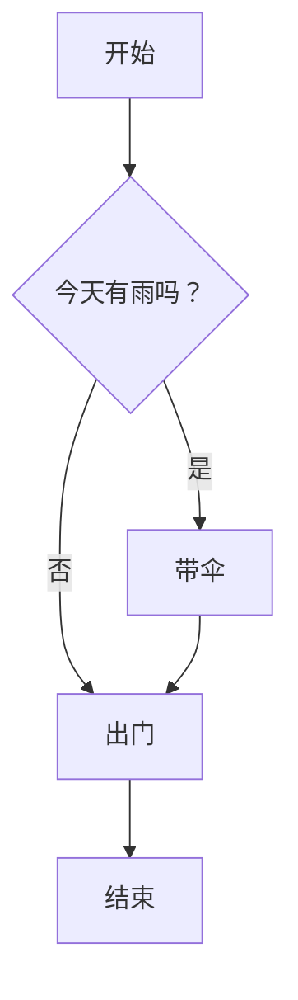
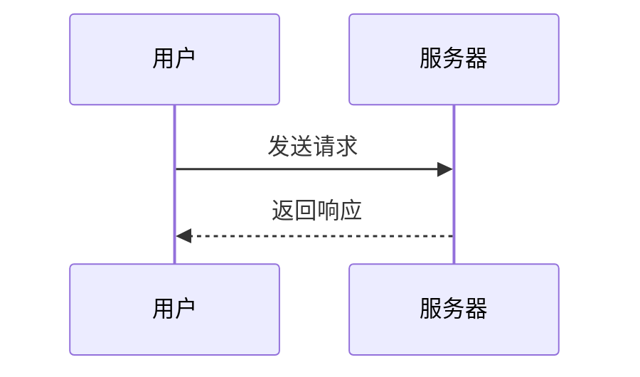
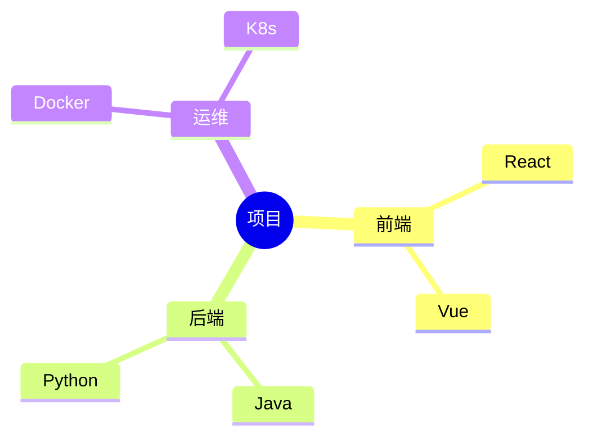

# mkdocs

## 环境配置

1. 安装virtualenv `pip install virtualenv`，在当前项目目录下创建python虚拟环境 `virtualenv -p /usr/bin/python3 venv`
2. 激活venv `source venv/bin/activate`
3. 安装依赖`pip install ``-``r requirements.txt`
4. 使用venv `source venv/bin/activate`
5. 退出even `deactivate`

>

## 文档目录配置

```yaml
site_name: 文档
pages:
    - 主页: index.md
    - 工作: [md1.md,md2.md]
    - 关于: about.md
```

## 自带主题修改

修改mkdocs自带的主题

1. 复制mkdocs的主题文件夹至自定义主题文件夹custom_theme下
2. 修改项目配置文件mkdocs.yml

```shell
theme:
  name: 'mkdocs'
  custom_dir: 'custom_theme'
```

3. 修改custom_theme/main.html，比如要修改底部的“Documentation built with MkDocs”

```shell

    <hr>
    
        <p>{{ config.copyright }}</p>
    
    <!--<p>Documentation built with <a href="https://www.mkdocs.org/">MkDocs</a>.</p>-->

```

## Mermaid 图表支持

当前使用 [Mermaid](https://mermaid.js.org/) 渲染图表，支持流程图、时序图、思维导图等。

### 流程图

````markdown

````

效果：


### 时序图

````markdown

````

### 思维导图

````markdown

````

效果：


## 发布文档

```shell
mkdocs gh-deploy --force
```

会生成gh-pages分支，在github中设置部署分支即可


## github图床

1. 登录github创建repo
2. 填写仓库资料，确保repo权限为public
3. 创建上传token，Settings -> Developer settings -> Personal access tokens，勾选repo
4. 安装picgo，配置图床


